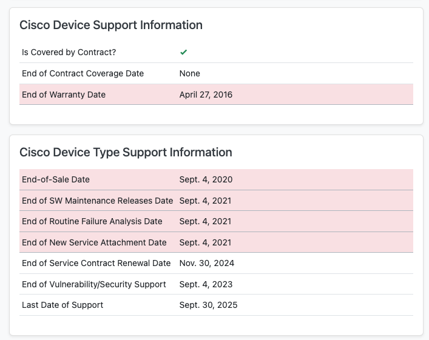

# NetBox Cisco Support API Plugin
[NetBox](https://github.com/netbox-community/netbox) plugin using Cisco Support APIs to gather EoX and Contract coverage information for Cisco devices.

## Compatibility
This plugin in compatible with [NetBox](https://netbox.readthedocs.org/) 3.0.3 and later.

## Installation
The plugin is available as a Python package in pypi and can be installed with pip

```
$ source /opt/netbox/venv/bin/activate
(venv) $ pip install netbox-cisco-support
```

Enable the plugin in `/opt/netbox/netbox/netbox/configuration.py`:

```
# Enable installed plugins. Add the name of each plugin to the list.
PLUGINS = ['netbox_cisco_support']

# Plugins configuration settings. These settings are used by various plugins that the user may have installed.
# Each key in the dictionary is the name of an installed plugin and its value is a dictionary of settings.
PLUGINS_CONFIG = {
    'netbox_cisco_support': {
        'cisco_client_id': 'bar',     # Client ID of your plugin installation. Generate it inside Cisco API Console
        'cisco_client_secret': 'bazz' # Client Secret of your plugin installation. Generate it inside Cisco API Console
    }
}
```

Restart NetBox and add `netbox-cisco-support` to your `local_requirements.txt`

```
(venv) $ cd /opt/netbox/netbox/
(venv) $ python3 manage.py migrate
# sudo systemctl restart netbox
```

Sync Cisco EoX data for the first time
```
(venv) $ cd /opt/netbox/netbox/
(venv) $ python3 manage.py sync_eox_data
````

To periodically refresh EoX data create a cronjob which calls `sync_eox_data` periodically
```
$ cat /etc/cron.d/netbox_sync_eox_data

# Update Cisco EoX Data every Saturday at 14:03
MAILTO="mail@example.com"
3 14 * * 6 /opt/netbox/venv/bin/python3 /opt/netbox/netbox/manage.py sync_eox_data
```

or log into /tmp file
```
$ cat /etc/cron.d/netbox_sync_eox_data

# Update Cisco EoX Data every Saturday at 14:03
3 14 * * 6 /opt/netbox/venv/bin/python3 /opt/netbox/netbox/manage.py sync_eox_data > /tmp/netbox_sync_eox_data
```

## Configuration
The following options are available:
* `cisco_client_id`: String - Client ID of your plugin installation. Generate it inside [Cisco API Console](https://apiconsole.cisco.com/)
* `cisco_client_secret`: String - Client Secret of your plugin installation. Generate it inside [Cisco API Console](https://apiconsole.cisco.com/)

## Requirements
In order to get the correct data using the API, several requirements must be fulfilled:
1. A [Cisco API ID and secret](https://apiconsole.cisco.com/) must have been created and configured inside `configuration.py`
2. A manufacturer called `Cisco` must have been configured inside NetBox. If your manufacturer is named differently, change if inside `configuration.py`:
```
PLUGINS_CONFIG = {
    'netbox_cisco_support': {
        ...,
        'manufacturer': 'Cisco Systems' # Optional setting for definiing the manufacturer
    }
}
```
3. All devices types for manufacturer Cisco must have filled the optional `Part number` field inside NetBox with the correct Base PID for that Cisco product.
4. All devices with devices types from manufacturer Cisco must have filled the `Serial Number` field inside NetBox with a valid Cisco serial number for that Cisco product.
5. If you want full visibility, the support contracts for all your devices needs to be associated with the CCO ID which has been used for created the API ID and secret. Otherwise you will only get a coverage true/false answer, but no detailed information regarding end of support contract coverage.

## How it works
1. Calling the sync_eox_data method will catch all device types for the configured manufacturer
2. Each device types `Part number` will be send to Cisco EoX API. API answer will be saved inside a `CiscoDeviceTypeSupport` model. One CiscoDeviceTypeSupport per device.
3. Afterwards all devices for the configured manufacturer will be gathered
4. Each devices `Serial number` will be send to Cisco sn2info coverage API. API answer will be saved inside a `CiscoDeviceSupport` model. One CiscoDeviceSupport per device.
5. The device type template will be extended to display this data. Information will be shown, if a `CiscoDeviceTypeSupport` object for that device type exists.
6. The device template will be exteneded to display device and device type information. Information will be shown, if a `CiscoDeviceSupport` object for that device exists. Additionally device type information will be shown, if a `CiscoDeviceTypeSupport` object for the parent device type exists.
7. Coloring: Expired timestamps will be colored red, timestamps which will expire in the next calendar year will be colored yellow for planning / forecast reasons.
## Screenshots
